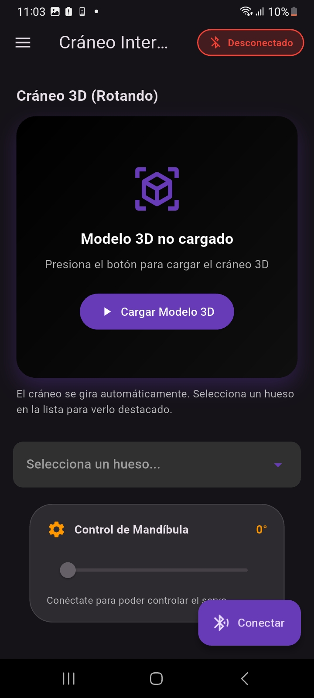
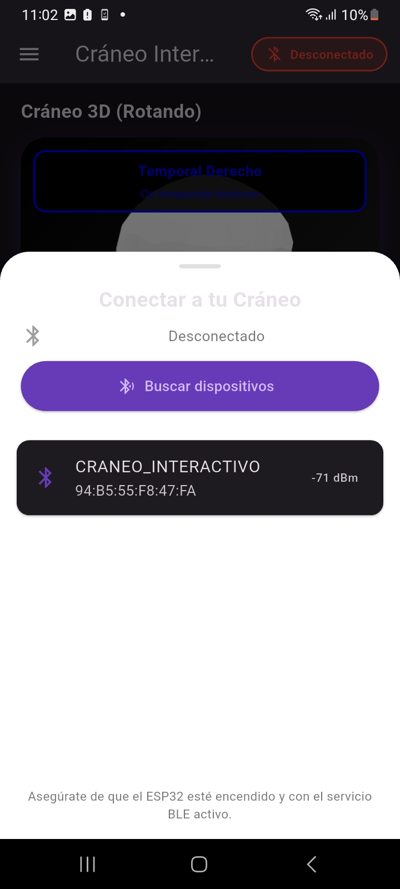
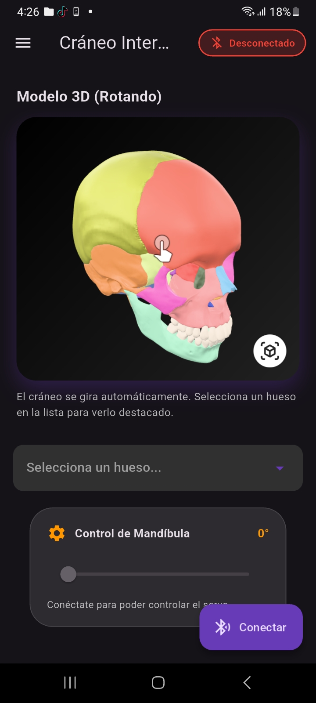
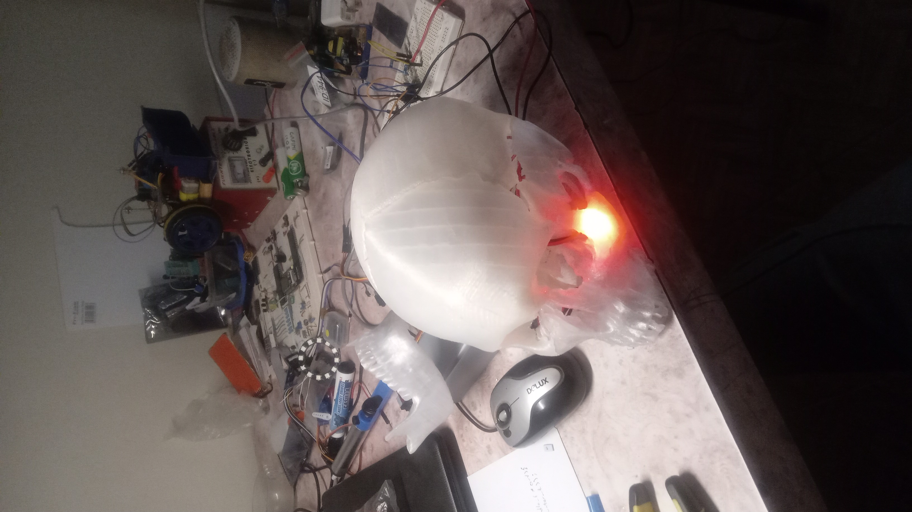
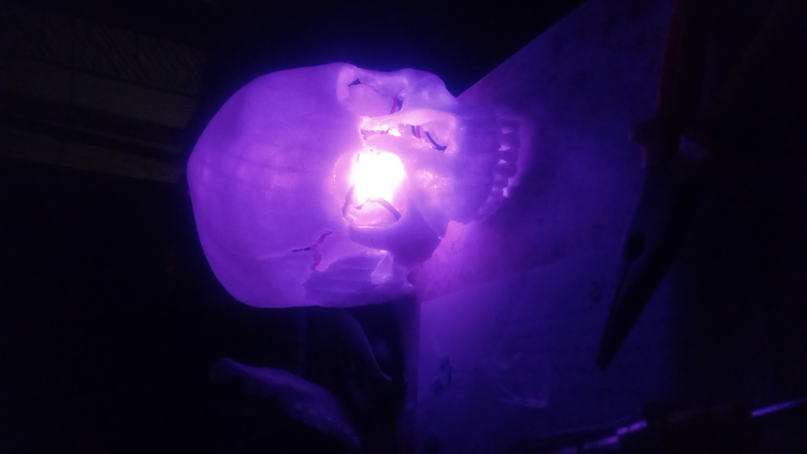
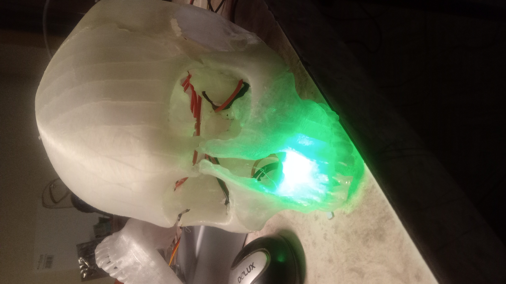

# Cráneo Interactivo

[](https://github.com/tu-usuario/craneo_app_1)
[](LICENSE)
[](https://flutter.dev)
[]()

[](README.md)
> **Estado: Alpha** - La aplicación está en desarrollo activo. Las funcionalidades principales están implementadas pero pueden contener errores. Reporta cualquier problema en [GitHub Issues](https://github.com/RodrigoCC/craneo_app_1/issues).

---

## Descripción 

Una aplicación Flutter para interactuar con un modelo 3D de cráneo humano a través de Bluetooth. Permite visualizar huesos del cráneo de forma dinámica (cambia automáticamente al seleccionar un hueso), controlar un servo motor y conectarse a dispositivos ESP32.

**Última actualización (Mayo 2026)**: 
- Modelo 3D del cráneo se muestra automáticamente al iniciar la app
- Cambio dinámico de modelos 3D al seleccionar huesos específicos con rotación automática
- Eliminación del botón "Cargar Modelo 3D" para una experiencia más fluida
- Botón "Ver Cráneo Completo" para resetear la vista
- Optimización del cambio de modelos con keys únicas para evitar problemas de renderizado
- Código optimizado sin warnings

## 👤 Autor y Versión

| Campo | Información |
|-------|-------------|
| **Autor** | Rodrigo C.C. |
| **Versión** | 0.1.3 |
| **Fecha** | Mayo 2026 |
| **Framework** | Flutter 3.11.0+ |
| **Plataforma** | Android |

---

## 📱 Capturas de Pantalla

<div align="center">
  
| Pantalla Principal | Conexión Bluetooth | Dropdown Huesos |
|:------------------:|:------------------:|:---------------:|
|  |  |  |

| Hueso cigomático | Hueso espfenoide | Maxilar superior |
|:--------------------:|:-----------------:|:---------:|
|  |  |  |

</div>

---
## Funcionalidades

- **Visualización 3D Interactiva**: Modelo interactivo del cráneo humano que rota automáticamente. Al seleccionar un hueso, el modelo cambia dinámicamente al hueso específico.
- **Selección de Huesos**: Dropdown para seleccionar huesos específicos del cráneo con cambio automático del modelo 3D.
- **Control de Servo**: Slider para controlar el ángulo de un servo motor conectado vía Bluetooth.
- **Conexión Bluetooth**: Escaneo y conexión a dispositivos ESP32 con servicios BLE.
- **Información Educativa**: Tarjetas con información detallada de cada hueso.

## Requisitos

- Flutter 3.11.0 o superior
- Dart 3.0.0 o superior
- Dispositivo Android con Bluetooth
- ESP32 con firmware BLE configurado

## Instalación

1. Clona el repositorio:
   ```bash
   git clone https://github.com/Rotronica/ESP32_BLE_App_Flutter_craneo_interactivo.git
   cd craneo_app_1
   ```

2. Instala las dependencias:
   ```bash
   flutter pub get
   ```

3. Ejecuta la aplicación:
   ```bash
   flutter run
   ```

## Uso

1. **Inicio**: La app solicita permisos de Bluetooth al iniciar y muestra el modelo 3D del cráneo completo girando automáticamente.
2. **Selección de Huesos**: Usa el dropdown para seleccionar huesos específicos del cráneo. El modelo 3D cambiará automáticamente al hueso seleccionado.
3. **Conexión**: Usa el botón "Conectar" para escanear y conectar a tu ESP32.
4. **Control**: Selecciona huesos y ajusta el servo cuando estés conectado.
5. **Información**: Accede al menú lateral para ver "Acerca de".

## Estructura del Código

```
lib/
├── main.dart              # Punto de entrada de la aplicación
├── src/
│   ├── app.dart           # Configuración principal de MaterialApp
│   ├── models/
│   │   └── hueso.dart     # Modelo de datos para huesos del cráneo
│   ├── screens/
│   │   └── home_screen.dart # Pantalla principal con modelo 3D y controles
│   ├── services/
│   │   └── ble_service.dart # Servicio para manejo de Bluetooth LE
│   └── widgets/
│       ├── connection_sheet.dart  # Hoja modal para conexión Bluetooth
│       ├── hueso_dropdown.dart    # Dropdown para selección de huesos
│       ├── hueso_info_card.dart   # Tarjeta con info del hueso
│       └── servo_control.dart     # Control deslizante para servo
```

## Secciones Importantes para Modificar

### 1. Configuración de Bluetooth (ble_service.dart)
- **Líneas 50-80**: Configuración de permisos Bluetooth
- **Líneas 85-140**: Lógica de escaneo BLE
- **Líneas 145-200**: Conexión y descubrimiento de servicios
- **Modificaciones comunes**: Cambiar UUIDs de servicios/características, ajustar timeouts

### 2. Interfaz de Usuario (home_screen.dart)
- **Líneas 40-60**: Estado de la aplicación (conexión, selección de hueso, modelo 3D actual)
- **Líneas 182-250**: Construcción del modelo 3D (siempre visible, cambia dinámicamente)
- **Líneas 108-140**: Controles de servo y selección de huesos
- **Líneas 485-510**: Botón "Ver Cráneo Completo" para resetear la vista
- **Modificaciones comunes**: Cambiar colores, agregar nuevos controles, modificar layout, ajustar modelos 3D

### 3. Modelo 3D (home_screen.dart)
- **Líneas 220-240**: Configuración del ModelViewer (auto-rotación, AR, controles)
- **Líneas 108-120**: Lógica de cambio de modelo al seleccionar hueso
- **Modificaciones comunes**: Cambiar ruta del modelo, ajustar parámetros de visualización, agregar nuevos modelos

### 4. Datos de Huesos (models/hueso.dart)
- **Líneas 1-25**: Definición de la clase HuesoCraneo (agregada propiedad modelFile)
- **Líneas 30-150**: Lista de huesos del cráneo con archivos de modelo
- **Modificaciones comunes**: Agregar/quitar huesos, cambiar información, colores, archivos de modelo

### 5. Conexión Bluetooth (connection_sheet.dart)
- **Líneas 80-120**: Lógica de escaneo y conexión en el build method
- **Líneas 120-180**: Lista de dispositivos encontrados y UI de conexión
- **Modificaciones comunes**: Cambiar filtros de dispositivos, modificar UI de conexión

### 6. Servicios BLE (ble_service.dart)
- **Líneas 280-300**: Envío de comandos al ESP32 (huesos y servo)
- **Modificaciones comunes**: Agregar nuevos comandos, cambiar protocolos de comunicación

## Dependencias Principales

- **flutter_blue_plus**: Para comunicación Bluetooth LE
- **permission_handler**: Para gestión de permisos
- **model_viewer_plus**: Para visualización de modelos 3D

## Desarrollo

Para contribuir o modificar la aplicación:

1. Asegúrate de que el ESP32 tenga el firmware correcto con los servicios BLE configurados.
2. Los UUIDs de servicios/características deben coincidir entre la app y el ESP32.
3. Prueba en dispositivos Android con Bluetooth 4.0+.

## Licencia

```
MIT License

Copyright (c) 2026 Rodrigo C.C.

Permission is hereby granted, free of charge, to any person obtaining a copy
of this software and associated documentation files (the "Software"), to deal
in the Software without restriction, including without limitation the rights
to use, copy, modify, merge, publish, distribute, sublicense, and/or sell
copies of the Software, and to permit persons to whom the Software is
furnished to do so, subject to the following conditions:

The above copyright notice and this permission notice shall be included in all
copies or substantial portions of the Software.

THE SOFTWARE IS PROVIDED "AS IS", WITHOUT WARRANTY OF ANY KIND, EXPRESS OR
IMPLIED, INCLUDING BUT NOT LIMITED TO THE WARRANTIES OF MERCHANTABILITY,
FITNESS FOR A PARTICULAR PURPOSE AND NONINFRINGEMENT. IN NO EVENT SHALL THE
AUTHORS OR COPYRIGHT HOLDERS BE LIABLE FOR ANY CLAIM, DAMAGES OR OTHER
LIABILITY, WHETHER IN AN ACTION OF CONTRACT, TORT OR OTHERWISE, ARISING FROM,
OUT OF OR IN CONNECTION WITH THE SOFTWARE OR THE USE OR OTHER DEALINGS IN THE
SOFTWARE.
```

## Soporte

- Para soporte técnico o preguntas:

- Abre un Issue en GitHub

- Contacta por email rodrigocallecondori5@gmail.com

- Revisa la documentación del ESP32 para problemas de firmware

